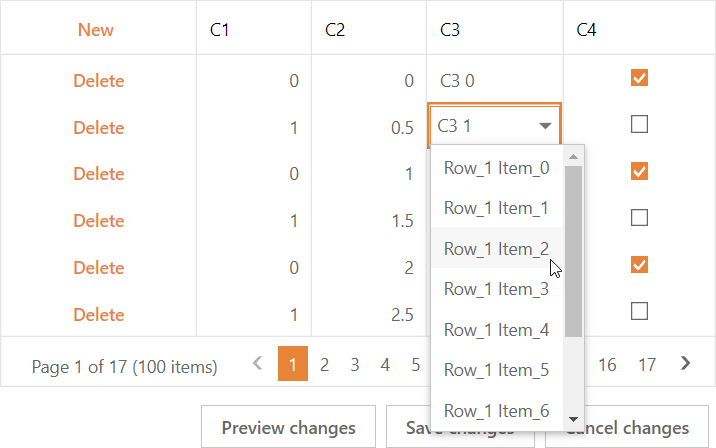

<!-- default badges list -->

[](https://supportcenter.devexpress.com/ticket/details/T190978)
[](https://docs.devexpress.com/GeneralInformation/403183)
<!-- default badges end -->
# Grid View for ASP.NET Web Forms - How to bind a Combo Box column to data in batch edit mode
<!-- run online -->
**[[Run Online]](https://codecentral.devexpress.com/t190978/)**
<!-- run online end -->


This example demonstrates how to populate a [GridViewDataComboBoxColumn](https://docs.devexpress.com/AspNet/DevExpress.Web.GridViewDataComboBoxColumn)'s cell editors at run time in batch edit mode.



## Implementation Details

In batch edit mode, the Grid View does not send requests to the server when a cell editor is activated. Therefore, it is not possible to use the [`CellEditorInitialize`](https://documentation.devexpress.com/#AspNet/DevExpressWebASPxGridView_CellEditorInitializetopic) event handler on the server to populate a combo box in each row.

To overcome this limitation, use the combo box editor's callback to populate the editor with items.

1. Handle the grid's [`CellEditorInitialize`](https://documentation.devexpress.com/#AspNet/DevExpressWebASPxGridView_CellEditorInitializetopic) event. In the event handler, assign a new handler to the combo box cell editor's [`Callback`](https://docs.devexpress.com/AspNet/DevExpress.Web.ASPxAutoCompleteBoxBase.Callback) event:

   ```cs
   protected void Grid_CellEditorInitialize(object sender, ASPxGridViewEditorEventArgs e) {
       if (e.Column.FieldName == "C3") {
           ASPxComboBox combo = e.Editor as ASPxComboBox;
           combo.Callback += combo_Callback;
       }
   }
   ```

2. Call the combo box editor's PerformCallback method from the client [`ASPxClientGridView.BatchEditStartEditing`](https://documentation.devexpress.com/AspNet/DevExpressWebASPxGridViewScriptsASPxClientGridView_BatchEditStartEditingtopic.aspx) event handler. Pass the current row's visible index as the callback parameter:

   ```aspx
   <dx:ASPxGridView ID="Grid" runat="server" KeyFieldName="ID" ... >
       ...
       <ClientSideEvents 
           BatchEditStartEditing="function(s, e){ cmb.PerformCallback(e.visibleIndex); }" 
       />
   </dx:ASPxGridView>
   ```

3. Add items to the combo box in the [`Callback`](https://docs.devexpress.com/AspNet/DevExpress.Web.ASPxAutoCompleteBoxBase.Callback) event handler. You can get the current row index from `e.Parameter`. 

   ```cs
   void combo_Callback(object sender, DevExpress.Web.ASPxClasses.CallbackEventArgsBase e) {
       ASPxComboBox combo = sender as ASPxComboBox;
       for (int i = 0; i < 10; i++) {
           combo.Items.Add(string.Format("Row_{0} Item_{1}", e.Parameter, i));
       }
   }
   ```

## Files to Look At

- [Default.aspx](./CS/Default.aspx) (VB: [Default.aspx](./VB/Default.aspx))
- [Default.aspx.cs](./CS/Default.aspx.cs) (VB: [Default.aspx.vb](./VB/Default.aspx.vb))

## Documentation

- [Passing Values Between Client and Server Sides](https://docs.devexpress.com/AspNet/11816/common-concepts/client-side-functionality/passing-values-between-client-and-server-sides)
- [Batch Edit Mode](https://docs.devexpress.com/AspNet/16443/components/grid-view/concepts/edit-data/batch-edit-mode)
- [Edit Cells](https://docs.devexpress.com/AspNet/3704/components/grid-view/concepts/data-representation-basics/cells/cells-overview#edit-cells)

## More Examples

- [Grid View for ASP.NET Web Forms - How to bind the GridViewDataComboBoxColumn edit form editor at runtime](https://github.com/DevExpress-Examples/aspxgridview-bind-comboboxcolumn-edit-form-editor-at-runtime)
- [Grid View for ASP.NET Web Forms - How to cache data on the client](https://github.com/DevExpress-Examples/aspxgridview-cache-data-on-the-client-side)